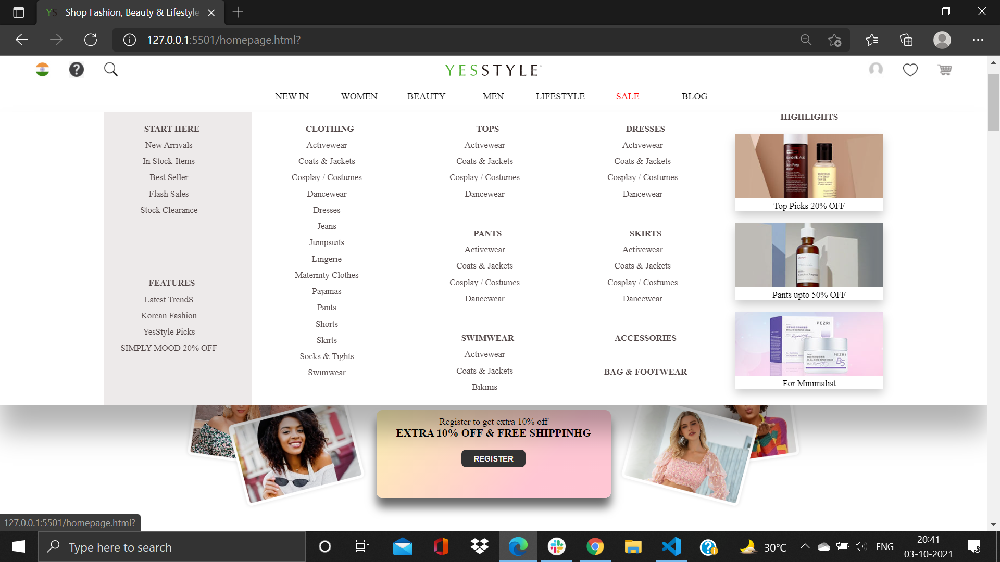
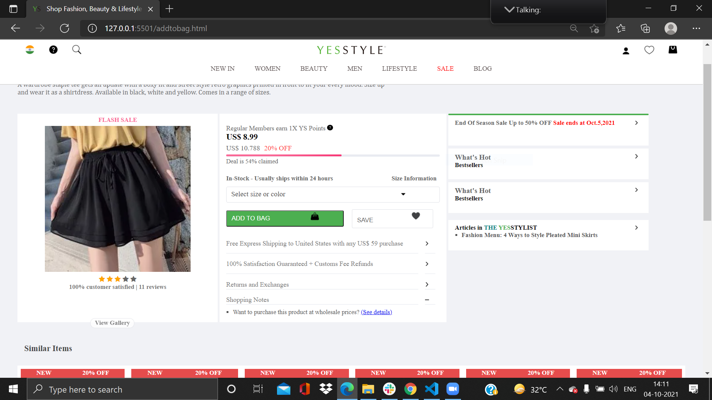
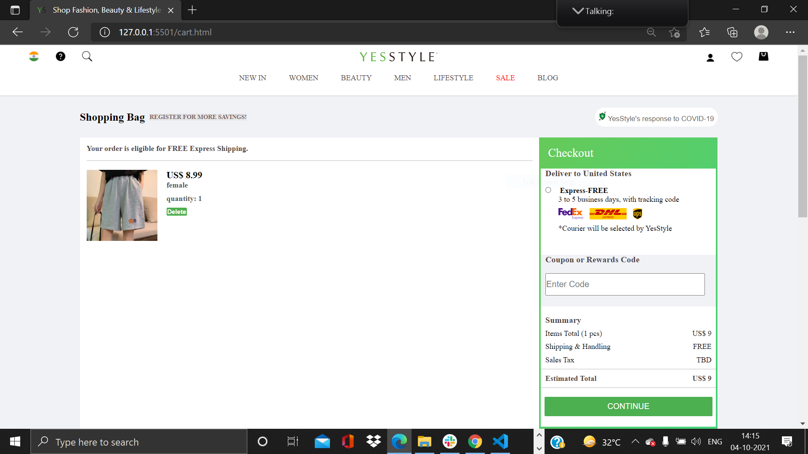

# YesStyle Clone

This project is a frontend practice project where I, **Manish Kumar**, built a clone of the YesStyle website to brush up on my JavaScript skills.

</img>

## Page Details

#### SIGN-IN PAGE

_
In this page, I used transitions and integrated both the sign-in and login functionalities into a single window.
_

#### LANDING PAGE

_
This is the landing page where users will experience an amazing UI and a user-friendly interface.
_

#### DROPDOWN BOX

_
This dropdown box on the homepage is created entirely using raw HTML & CSS, showcasing the development of amazing UI components.
_

#### PRODUCT DISPLAY PAGE

_
This page displays the products available for purchase. Users can view product details and add items to their cart.
_

#### CART PAGE

_
This dynamic page allows users to modify their cart at any time. After adding at least one product to the cart, a checkout box will pop up to proceed with the payment process.
_

#### CHECKOUT PAGE

_
Here, users can apply discount coupons and vouchers, which are valid for a single use, to see the final price.
_

#### PAYMENT PAGE

_
Two payment methods are available on this page:_ 
**1 - Card Payment** 
**2 - Cash On Delivery** 
_
Once users enter their details, they will see a "Payment Successful" message.

_

<h4>Contributor</h4>

- **Manish Kumar**  
  [GitHub](https://github.com/manishsingh0418)  
  [LinkedIn](https://www.linkedin.com/in/manishsingh0418/)
"# YesStyle" 
